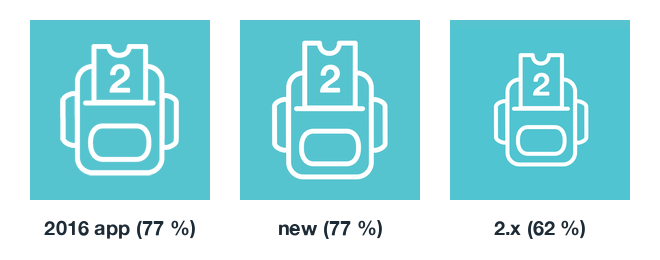
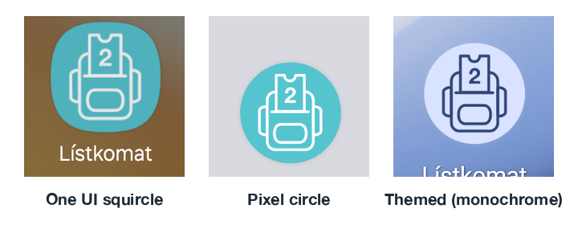

# App icon — canonical source for iOS and Android

One drawing, one script, every platform's icon. Both apps ship exactly this art.

## Provenance

The backpack-with-a-ticket is the 2016 Lístkomat icon, recovered from Jiri's
iCloud (`Documents/Lístkomat/TicketBuyer_logo.svg`, with `.ai`/`.sketch`
masters next to it). `backpack.svg` is that file with two changes:

- styles inlined as presentation attributes (4-unit white strokes, the
  original caps/joins/miter limits), and
- the "2", originally a `<text>` in Alte Haas Grotesk Bold 31.99 px, converted
  to an outline from `Listkomat/Resources/Fonts/AlteHaasGroteskBold.ttf` at the
  original `translate(38.49 42.42)`. Rendering needs no font.

It was generated once with `python3 Design/app-icon/render.py backpack <TicketBuyer_logo.svg>`;
edit `backpack.svg` directly from now on.

## The 77 % rule

The art (stroke outline included) is **77 % of the visible tile height**,
centred vertically and centred horizontally on the backpack *body*. The straps
are near-symmetric: the body centre sits 0.19 art units off the centre of the
stroked bounding box, which is invisible at any icon size.

Why 77 %: the 2016 app shipped `icon60@3.png` with the art at 77 %, which
is why it looked "bigger, more full" next to the 2.x icon (62 %, the 2016
1024 export). The 2016 small icon is a slightly squatter variant of the
drawing (wider straps, shorter ticket), so matching its *height* alone
(73 %) looks lighter. 77 % matches its visual weight (bounding-box area)
and also gives the lowest pixel difference against it. Stroke width
matches the 2016 icon at this size too (≈ 5 px at 180 px).



Per platform:

| Output | Geometry |
|---|---|
| iOS `AppIcon1024.png` | 1024 px teal square, art 788 px tall. Square corners — iOS masks. |
| Play `icon-512.png` | the same composition at 512 px. Play masks the corners. |
| Android `ic_launcher_foreground.xml` | 108 dp adaptive canvas, visible centre 72 dp → art 55.4 dp tall, centred at (54, 54). It reaches 30.3 dp from the centre, inside the 66 dp safe circle; `render.py` checks this. Background layer is `@color/ic_launcher_background` = `#56C4CF`; the `monochrome` layer reuses the foreground. |
| Play `feature-1024x500.png` | 1024 × 500 teal, RGB. "Lístkomat" (ink `#1F1F1F`, cap height 78 px, baseline 258) over "SMS jízdenky na MHD" (`#0F464C`, 33 px, baseline 333), both Alte Haas Grotesk Bold as outlines, ink starting at x = 78 / 73: the first graphic's measured layout (Alte Haas runs a little wider). The art replaces its ticket glyph, centred on the same point (810, 250), 256 px tall, set by eye: the outline art is lighter than the solid glyph, so matching its size would look faint. `render.py` refuses a layout where text and art come within 40 px or leave the canvas. |

On real launchers (Galaxy A14 / One UI 6, Pixel 7 emulator / API 35), the
art measures 78 % of the squircle and 76 % of the circle, centred to within
1 px:



## Regenerating

```sh
brew install librsvg && pip install fonttools pillow
python3 Design/app-icon/render.py --android-repo ../listkomat-android
```

This rewrites `icon-1024.svg` (the composition), the iOS `AppIcon1024.png`
and, with `--android-repo`, the Android foreground vector,
`play/assets/icon-512.png` and `play/assets/feature-1024x500.png`. It
reproduces the committed files byte for byte with rsvg-convert 2.60.0 and
Pillow 12.1.1 (Pillow re-encodes the PNGs). Other versions may antialias or
compress differently; that is harmless, but commit the result from one set of
versions. The iOS PNG is RGB (App Store Connect rejects alpha); the Play icon
PNG is RGBA, as Play asks for a 32-bit PNG; the feature graphic is RGB (Play
takes no alpha there).

The Play Console listing images are **not** uploaded by any script: after
changing `icon-512.png`, upload it by hand in Play Console → Main store
listing → App icon; after changing `feature-1024x500.png`, in Store listings →
Default → Common visual assets → Feature graphic.

The Android vector keeps the SVG path data and transforms as `<group>`s
(VectorDrawable scales stroke width with the group), so nothing is traced or
flattened by hand. `render.py` refuses transforms other than `translate(x y)`
and path data it can't tokenise unambiguously (e.g. arc flags without
separators), rather than emitting a wrong icon.

## Follow-ups

- iOS 18 dark and tinted icon variants (optional; not done). A dark variant
  would be the same art on the ink background, and a tinted one a greyscale
  of the backpack.
